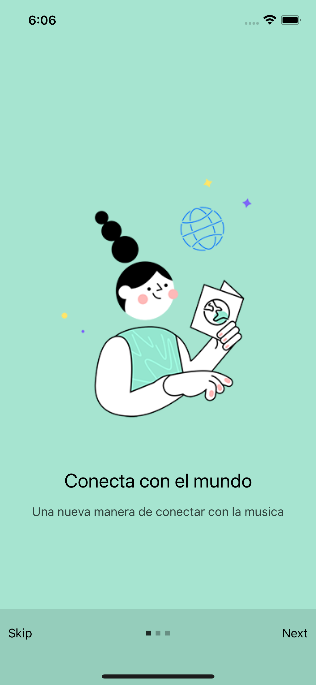
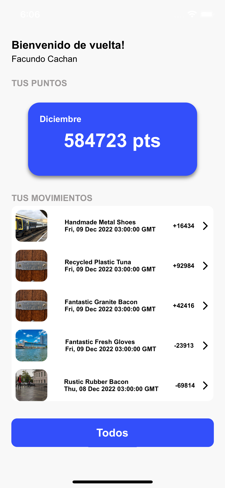
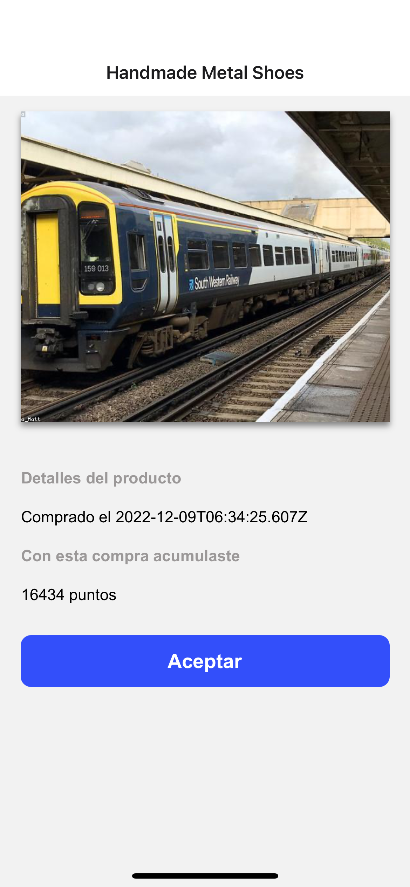

## Run instructions for Android:

• Have an Android emulator running (quickest way to get started), or a device connected.
• cd "/Users/facundo/Projects/Challenges/multiplica" && npx react-native run-android

## Run instructions for iOS:

• cd "/Users/facundo/Projects/Challenges/multiplica" && npx react-native run-ios

- or -
  • Open multiplica/ios/multiplica.xcworkspace in Xcode or run "xed -b ios"
  • Hit the Run button

## Run instructions for macOS:

• See https://aka.ms/ReactNativeGuideMacOS for the latest up-to-date instructions.

# Criteria of acceptance
- [x] Connection to endpoint
- [x] Navigation between screens
- [x] Unit tests

## The following items are desirable:
- [x] Filter
- [] Keep all elements "pixel perfect"
- [x] Component or integration unit testsComponent or integration unit tests

## Previews Snapshots

  
  
  

<h5>Star 10 Feb 2023.</h5>
<h5>End  13 Feb 2023.</h5>
